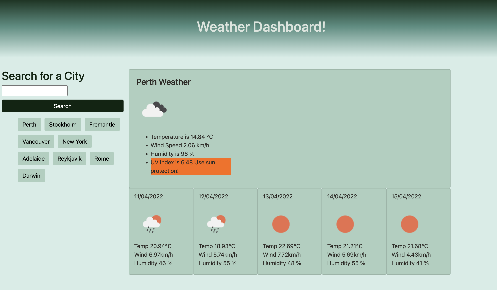

# <Weather Dashboard>

## Description

- My task was to create an online Weather Dashboard using HTML, CSS and JavaScript which would interactively bring up the current and future weather forecast for a city the user searches, and then save that city to LocalStorage to be easily accessed again
- I was motivated by the idea of using APIs to provide relevant, helpful and accessible information which could populate a site with useful information
- I have learnt a lot during the creation of this site and thoroughly enjoyed the thrill of it all coming together
- This site was an incredible challenge and I feel far more competent with my ability to tackle problems due to this amazing experience

## Instructions

To use my Weather Dashboard, simply fill in the name of the city for which you would like to view, and submit. You will be shown a large card filled with the current weather conditions, along with 5 smaller cards which display information for a 5 day weather forecast look ahead! Your city will also be stored as a recent search button, which can be used to navigate back to this weather forecast. To view a different forecast, simply type another city name into the bar and submit, or pick from the list of recent search buttons. Enjoy!

## Demo

## Access

To access my Weather Dashboard, I've added these links

GitHub Repository:
https://github.com/kieranmichaelflynn/Weather-Dashboard.git

GitHub Pages: 
https://kieranmichaelflynn.github.io/Weather-Dashboard/

Thank you